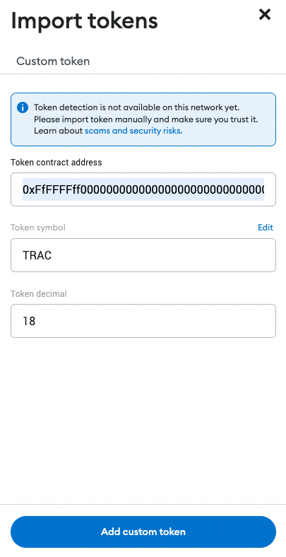

# Add TRAC to Metamask

Here are step by step instructions for adding TRAC token to Metamask that is connected to OriginTrail Parachain. This instructions and TRAC token address are same for both OriginTrail Parachain mainnet and testnet.

TRAC token address: 0xFfFFFFff00000000000000000000000000000001

First open Metamask that is connected to OriginTrail parachain (connection details available here), then under the Assets tab click on `Import tokens`.

<figure><figcaption></figcaption></figure>

On the import tokens page you need to add TRAC token contract address and usually all other fields will be automatically populated by Metamask.

<figure><figcaption>
Import TRAC token
</figcaption></figure>

After you get all fields filled with right information (like on the image above), you click `Add custom tokens` and your TRAC balance will be displayed in Metamask.
