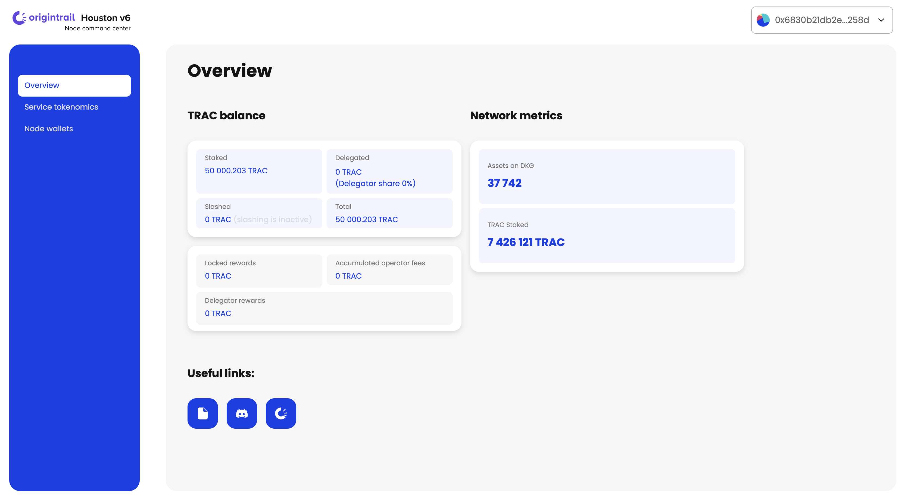
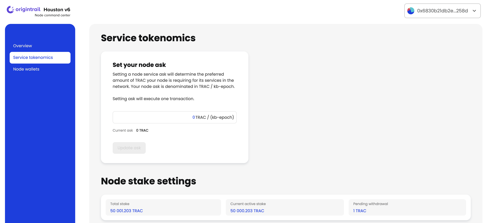
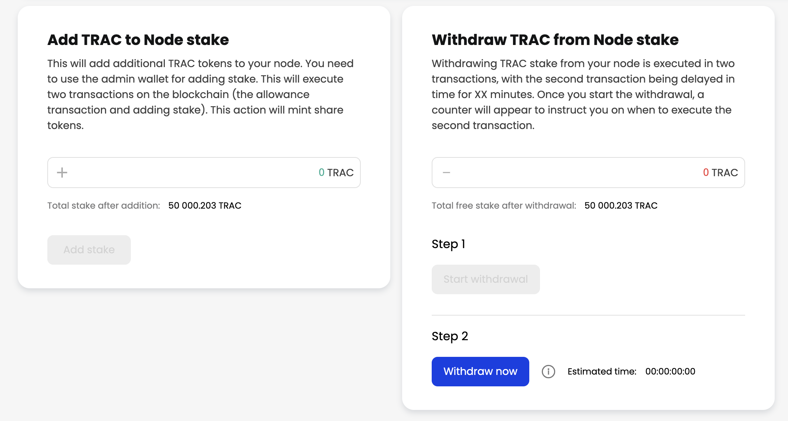
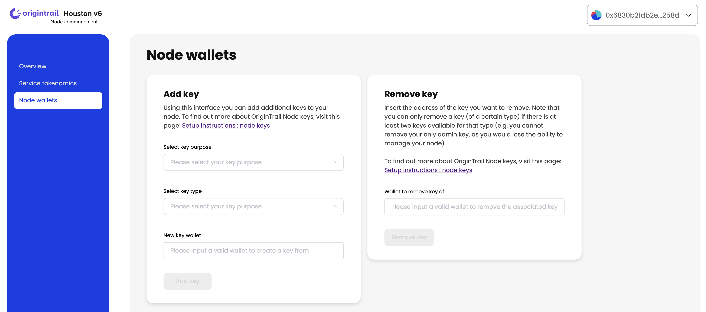

# Houston - OriginTrail node command center

There are two ways you can use the Houston application:

1. Via a hosted application, which is available at the following link: [https://houston.origintrail.io/](https://houston.origintrail.io/) or
2. Run Houston Web application locally by following the setup [instructions](houston-origintrail-node-command-center.md#setup-houston-locally).

**Houston is an open source project and we welcome your contributions on the** [**official project repository.**](https://github.com/OriginTrail/houston-v6/)

### Usage instructions:


The Houston application currently requires the Metamask browser extension to be installed in order to connect to the node. Additional wallets will be supported in the future releases.


1. When Houston application opens, you will be presented with a login form. Make sure to choose the right network (OriginTrail DKG Mainnet or OriginTrail DKG Testnet).
2. After choosing the network you will have to connect and authenticate your node's admin key with Metamask by clicking the “Connect admin wallet” button.
3. Paste your node’s operational wallet address into the “Operational wallet address” input field.
4. Connect by clicking the “Connect via Houston” button.

<figure><figcaption><p>Houston - Login</p></figcaption></figure>

Houston currently helps you interact with OriginTrail DKG smart contracts. In the future versions Houston will enable connecting to your nodes directly as well.

### &#x20;Overview:

The Overview section shows general information about your node TRAC balance and network metrics.

<figure><figcaption><p>Houston - Overview section</p></figcaption></figure>

### Service tokenomics:

Under “**Service tokenomics**” section, you’re able to manage TRAC stake settings on the node as well as updating:

* Ask parameter, which will determine the preferred amount of TRAC your node is asking for its services in the network,
* Add and withdraw TRAC stake. Note that both operations require executing 2 transactions.

<figure><figcaption><p>Houston - Service tokenomics section 1.1</p></figcaption></figure>

<figure><figcaption><p>Houston - Service tokenomics section 1.2</p></figcaption></figure>


### Node wallets:

This section allows node runners to add additional keys (wallets) or remove keys from the node. OriginTrail V6 node operates with 2 key types (admin key and operational key).&#x20;

Houston will allow a node runner to remove a key (of a certain type) if there are at least two keys available for that type (e.g. you cannot remove your only admin key, as you would lose the ability to manage your node).


When you stake TRAC tokens to your DKG node with an admin wallet, that admin wallet will receive a certain amount of “Stake Share Tokens” in return. Stake share tokens are ERC20 tokens that represent the amount of shares of the total token stake that this particular wallet owns. Unstaking TRAC tokens from your DKG node is performed by “burning” an amount of share tokens. (e.g. you can burn 10% of your share tokens to get back 10% of your staked TRAC. This approach is similar to AMMs such as Uniswap and their LP tokens representing ownership share in token pairs liquidity pools).\


This means that, in case of you wanting to use multiple admin wallets to manage your node (by adding additional admin wallets), only the wallets that own share tokens will be able to manage the TRAC stake.\
\
For example, if you would like to swap one admin wallet which has already staked TRAC tokens, for another fresh admin wallet, apart from adding the new admin wallet you should make sure to also transfer your TRAC stake to the new wallet. This can be done in two ways::

* By transferring share tokens from the current admin wallet to the new wallet (since the Share token is ERC20, they can be transferred to another wallet easily) You can see your node share token address in Houston. This is the recommended option as your node TRAC stake will not change during this operation.
* Unstaking all TRAC tokens and moving them to the new admin wallet. After transferring the tokens to the new wallet, they must be staked again with the new admin wallet. This means that for the period of time that your node is without TRAC stake, it will not participate in hosting in the network, risking that it can lose rewards.


Please make sure to exercise caution when handling staked tokens and make sure to choose the best approach that meets your needs.


<figure><figcaption><p>Houston - Node wallets section</p></figcaption></figure>

To find out more about OriginTrail Node keys, visit the following page: [Setup instructions: Node keys](https://docs.origintrail.io/decentralized-knowledge-graph-layer-2/testnet-node-setup-instructions/node-keys).

### &#x20;Upcoming Houston features:

With the future versions of Houston application, multiple features are to be introduced, such as connecting to your node and token delegation.&#x20;

If you have ideas on how to improve or extend Houston, we’d love to have you contribute to the project [via the official repository](https://github.com/OriginTrail/houston-v6).&#x20;

\
In order to stay in the loop with the latest Houston & OriginTrail developments, please join our [Discord](https://discordapp.com/invite/FCgYk2S) channel and follow our social media accounts.

### Setup Houston locally:

#### Requirements:

* Node.js: v16

#### How to run Houston:

1\. Clone the project:

```
git clone https://github.com/OriginTrail/houston-v6.git
```

2\. Install dependencies:

```
cd houston-v6 && npm install
```

3\. Run Houston application:

```
npm run serve
```


Houston application will be available at [http://localhost:8080/](http://localhost:8080/) in the browser of your choice.&#x20;


4\. Compile and minify for production purposes:

```
npm run build
```

