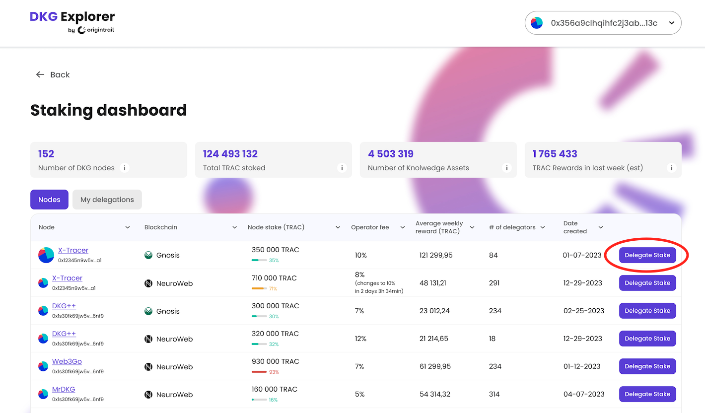
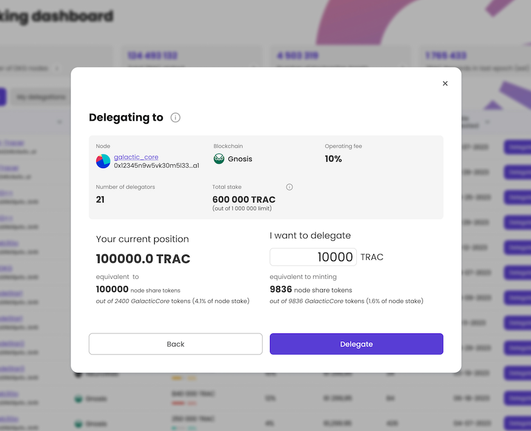
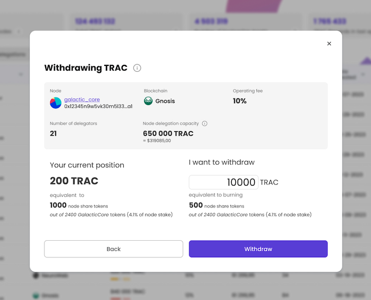

# 🚀 Delegated staking

For a DKG node to be eligible to host a portion of the [DKG](../../general/dkgintro.md) and receive TRAC network rewards, its TRAC stake plays a crucial role. Set at the minimum of 50 000 TRAC on a particular blockchain, stake has an important role in ensuring security of the DKG. The DKG node operators can contribute to the node stake on their own or by attracting more TRAC to their stake through delegated staking. &#x20;

There are 2 roles involved in delegated staking -  **node operators** and **TRAC delegators**.

**Node operators** are network participants who choose to host and maintain network nodes (specialized DKG software running servers). Nodes store, validate and make knowledge available to AI systems. They receive $TRAC rewards for this service. All nodes together form a permissionless market of DKG services, competing for their share of network TRAC rewards.

**Delegators** lock up their $TRAC for contributing to the DKG security on selected DKG nodes and increasing their chance of capturing TRAC network rewards. The rewards that end up being captured by the DKG node are then shared between the $TRAC stake delegators. The delegated tokens are locked in a smart contract and are never accessible to the node operators.

Note that node operators and node delegators are not distinct - you can be both at the same time.


Contrary to inflationary systems, TRAC staking is strictly utility-based and rewards are generated through DKG usage via knowledge publishing fees.


### How do delegators earn TRAC fees?

As knowledge publishers create [Knowledge Assets](../dkg-basic-concepts.md) on the DKG, they lock an appropriate amount of TRAC tokens in the DKG smart contracts. The TRAC amount offered has to be high enough to ensure enough DKG nodes will store it for a specific amount of time (more details on the DKG market mechanics [here](https://github.com/OriginTrail/OT-RFC-repository/blob/main/RFCs/OT-RFC-14%20DKG%20v6%20TRAC%20Tokenomics.pdf)). The nodes then commit to storing the knowledge assets for a specific amount of time, measured in **epochs which last 3 months**.&#x20;

At the end of each epoch, DKG nodes prove to the smart contract that they are still storing a Knowledge Asset and unlock the TRAC reward locked initially by the knowledge publisher.&#x20;

Many nodes can compete for the same TRAC reward but only 3 nodes can receive the rewards for each Knowledge Asset. The ranking list of nodes is created on the basis of:

* storing price (ask) - should be below what publisher offered to pay;
* stake - the higher the DKG node stake, the greater the chance of receiving rewards;
* neighborhood distance - outside of neighborhood use for network addressing purposes, the neighborhood distance is used as a randomisation factor ensuring that the network doesn’t get dominated by a single node.&#x20;

You can see more details about the reward mechanism in the [Tokenomics RFC](https://github.com/OriginTrail/OT-RFC-repository/blob/main/RFCs/OT-RFC-14%20DKG%20v6%20TRAC%20Tokenomics.pdf), but the key element of the system is that the DKG nodes with higher stake will be more successful so **by providing TRAC stake to a node, you increase its chances of collecting rewards**.

After claiming the rewards, they are **automatically restaked, increasing the nodes overall stake by the amount of collected rewards.**


Note: The epoch length on DKG mainnet is 3 months.


### How does DKG delegated staking work?

Once you delegate TRAC tokens to a node, in return you receive node “share tokens” (similar to Uniswap LP tokens). Each node deployed on OriginTrail has a node-specific, mintable and burnable ERC20 token created during node deployment, with the token symbol and name set by the node operator (an example of such a node share token on NeuroWeb blockchain can be found [here](https://neuroweb.subscan.io/erc20\_token/0x98136e72d70b0c52bb253b9bb6902956d213f117?tab=transfers)).&#x20;

When you delegate TRAC tokens to a node, they are locked inside DKG smart contracts, a proportional amount of node share tokens is minted for you and sent to your delegating wallet address. To withdraw your TRAC, you simply burn the share tokens via the DKG smart contracts, unlocking your TRAC tokens. As your TRAC is locked in the DKG smart contracts, the node operator has no access to your locked TRAC tokens at any time.

In order to introduce a level of predictability of network operations, withdrawing tokens is subject to an unbonding period of 28 days.


Delegated staking is a non-custodial system, so the node operator has no access to the locked TRAC tokens at any time.


\
Each node operator can also set an “**operator fee**” which is taken as a percentage of the TRAC rewards deducted each time when a node claims rewards from a knowledge asset. The remaining TRAC fee is then split proportionally to the share of staked tokens across all delegators.


**Example**: if a node accumulated **1000 TRAC** tokens in the previous period, and the node has two delegators both of 50% share, and the operator\_fee is 10%:

* the node operator will receive 100 TRAC (10%)
* each delegator receives 450 TRAC (50% of the remaining 900 TRAC)


## Delegating your TRAC: Step by step

### 1. Get your TRAC ready and open the Staking Dashboard

Prepare your wallet by acquiring the TRAC tokens and native gas tokens for the blockchain you are staking on.

Then navigate to the [DKG Delegated Staking Dashboard](https://dkg.origintrail.io/staking)

### 2. Connect your wallet and select the right blockchain

In the upper right corner of the Staking Dashboard, click on the "Connect Wallet" button, and select your desired wallet in Metamask.

Check your Metamask and confirm that you are connected to the right network. To add these networks to Metamask

* for **Neuroweb**: Check the [official Neuroweb documentation here](https://docs.neuroweb.ai/neuroweb-technical-information/available-networks)
* For **Gnosis:** Check the [official Gnosis instructions here](https://docs.gnosischain.com/developers/getting-started/quickstart)

### 3. Pick a DKG node to delegate TRAC to

* Pick one or more nodes to which you'd like to delegate your TRAC tokens. Consider the node's performance and characteristics (such as the operator fee, accumulated stake, pending rewards, etc.)
* Click the "Manage stake" button to open the delegation popup

<figure><figcaption>
Indicative dashboard
</figcaption></figure>

* Designate how much TRAC you want to delegate to this node in the input box
* Click the **Delegate button** to initiate the delegation process. This will entail two blockchain transactions - the token **approval** transaction, and the TRAC **token transfer** transaction**.**

<figure><figcaption>
Indicative Delegation popup modal
</figcaption></figure>

* Once the transactions are executed successfully, you will receive node share tokens in your wallet. (make sure to keep those tokens to be able to withdraw your TRAC rewards later)
* That's it, you have successfully delegated TRAC tokens to a DKG node!

### 5. Come back to collect your TRAC rewards after a while

Over time the amount of TRAC tokens earned by the node will grow (as the node accumulates knowledge asset fees, increasing the node's total stake). A portion, proportionate to the amount of share tokens you own to that node, will be available for you to withdraw (after the deduction of the operator fee). You can initiate the withdrawal of the accumulated TRAC at any time by burning a portion of your node share tokens. The withdrawal is performed in two transactions, with a 28 day delay.

<figure><figcaption>
Indicative Withdrawal popup modal
</figcaption></figure>

### If you are running a node

If you are running a DKG node you can delegate TRAC tokens to your node in the same way as described above (effectively assuming the role of a delegator). It is recommended you delegate TRAC tokens as well, signalling your commitment to the network via economic stake - this provides a trust signal to other delegators.

To understand how to set up your operator fee, follow the [node-setup-instructions](../node-setup-instructions/ "mention") instructions for node setup. Note that changing your operator fee incurs a 28 day delay, balancing the 28 day delay delegators experience when withdrawing stake from your node.&#x20;

<figure><figcaption>
Depiction of delegating and withdrawing of TRAC from DKG smart contracts
</figcaption></figure>

### What is next for delegated staking?

After successful deployment and verification on Gnosis blockchain, the delegated staking feature will roll out to all other DKG supported blockchains.

### Have questions?

Drop by our [Discord](https://discordapp.com/invite/FCgYk2S) or [Telegram group](https://t.me/origintrail) and feel free to post it there. Make sure to follow our official announcements and stay safe!

Happy staking! :rocket:

