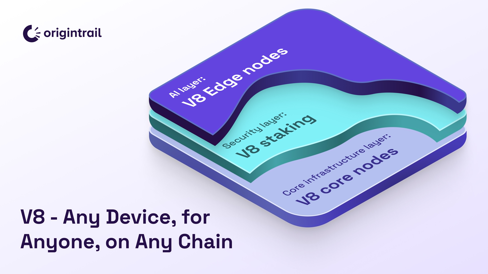

# Delegated Staking Introduction

As a decentralized system, the OriginTrail DKG enables all ecosystem stakeholders owning TRAC to contribute their economic stake to the functioning of the network for utility. Delegated staking involves locking up TRAC for contributing to the DKG security on selected DKG Core Nodes. The DKG Core Node rewards are shared between the TRAC stake delegators.

<figure><figcaption></figcaption></figure>

## TRAC delegated staking mechanics

For a DKG Core Node to be eligible to host a portion of the DKG and receive TRAC network rewards, its TRAC stake plays a crucial role. Set at a minimum of 50,000 TRAC on a particular blockchain, the stake has an important role in ensuring the security of the DKG. The DKG Core Node operators can contribute to the node stake on their own or by attracting more TRAC to their stake through delegated staking.&#x20;

There are 2 roles involved in delegated staking -  **Core Node operators** and **TRAC delegators.**

**Core Node operators** are network participants who choose to host and maintain core network nodes (specialized DKG software running servers). Core Nodes store, validate, and make knowledge available to AI systems. They receive $TRAC rewards for this service. All Core Nodes together form a permissionless market of DKG services, competing for their share of network TRAC rewards.

**Delegators** lock up their TRAC to contribute to the DKG security on selected DKG Core Nodes and increase their chance of capturing TRAC network rewards. The rewards that the DKG Core Node captures are then shared between the TRAC stake delegators. The delegated tokens are locked in a smart contract and are never accessible to the Core Node operators.

Note that Core Node operators and node delegators are not distinct - you can be both at the same time.


Contrary to inflationary systems, TRAC staking is strictly utility-based, and rewards are generated through DKG usage via knowledge publishing fees.


#### How do delegators earn TRAC fees?

As knowledge publishers create Knowledge Assets on the DKG, they lock an appropriate amount of TRAC tokens in the DKG smart contracts. The TRAC amount offered has to be high enough to ensure that enough DKG Core Nodes will store it for a specific amount of time. The nodes then commit to storing the Knowledge Assets for a specific amount of time, measured in **30-day periods called epochs**.\

At the end of each epoch, DKG nodes "prove" that they are providing DKG services to the DKG smart contracts, which in turn unlocks  TRAC rewards initially locked by the knowledge publisher.&#x20;

\
Many Core Nodes can compete for the same TRAC reward on the basis of their total stake, node ask, and publishing factor. Node rewards are a function of 4 parameters in order of importance:

1. **Node uptime & availability,** in positive correlation, as nodes need to prove their commitment to hosting the DKG by submitting proofs to the blockchain (through the new V8 random sampling proof system);
2. **TRAC stake security factor,** in positive correlation - the more stake a node attracts, the higher the security guarantees and, therefore, the higher chance of rewards;
3. **Publishing factor,** in positive correlation - the more new knowledge has been published via a specific Core Node (measured in TRAC tokens), the higher the chance of rewards;
4. **Node ask,** in negative correlation - the nodes with asks lower than the current network fee are positively impacting the system scalability and, therefore, have a higher chance of rewards.

More details are presented in[ OT-RFC-21](https://github.com/OriginTrail/OT-RFC-repository/blob/main/RFCs/OT-RFC-21_Collective_Neuro-Symbolic_AI/OT-RFC-21%20Collective%20Neuro-Symbolic%20AI.pdf)

After claiming the rewards, the rewards are **automatically restaked, increasing the Core Node's overall stake by the amount of collected rewards.**

In order to introduce a level of predictability of network operations, withdrawing tokens is subject to an unbonding period of 28 days.


If you want to withdraw tokens in order to delegate to another node on the same network (blockchain) - you **do not** have to wait 28 days! [See here >](redelegating-stake.md)&#x20;



Delegated staking is a non-custodial system, so the Core Node operator has no access to the locked TRAC tokens at any time.


Each Core Node operator can also set an “**operator fee,**” which is a percentage of the TRAC rewards deducted each time when a node claims rewards from a Knowledge Asset. The remaining TRAC fee is then split proportionally to the share of staked tokens across all delegators.


**Example**: If a node accumulated **1,000 TRAC** tokens in the previous period, and the node has two delegators, both with a 50% share, and the operator\_fee is 10%:

* the node operator will receive 100 TRAC (10%)
* each delegator receives 450 TRAC (50% of the remaining 900 TRAC)


#### If you are running a Core Node

If you are running a DKG Core Node, you can delegate TRAC tokens to your node in the same way as others. It is recommended that you also delegate TRAC tokens, signaling your commitment to the network via economic stake - this provides a trust signal to other delegators.

To understand how to set up your operator fee, follow the instructions for Core Node setup. Note that changing your operator fee incurs a 28-day delay, balancing the 28-day delay delegators experience when withdrawing stake from your node.

<figure><figcaption>
Depiction of delegating and withdrawing of TRAC from DKG smart contracts
</figcaption></figure>

\
**Have questions?**

Drop by our [Discord](https://discord.com/invite/xCaY7hvNwD) or [Telegram group](https://t.me/origintrail), and feel free to ask your questions there. Make sure to follow our official announcements, and stay safe!

Happy staking! 🚀

\
\
