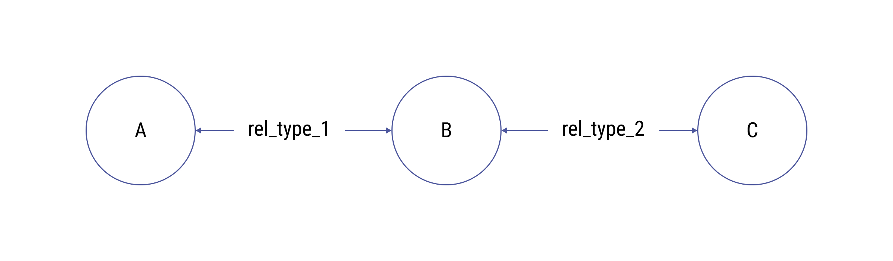
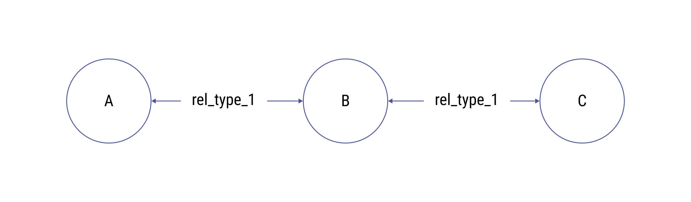

# Querying data from the DKG

## How does querying of the DKG work?

The DKG querying entails both data discovery and graph querying. Therefore OriginTrail implements a set of protocols for discovery and exchange which cover a wide array of possible scenarios. 

### Network query

Querying the DKG is done using the network query API. It is used to look up all datasets containing a specific identifier (such as a supply chain identifier, like a GS1 barcode or RFID value).

The query request is an array values that identify a particular object in a dataset. These identifiers are sent as an array of objects, where the `path` parameter is the type of identifier (such as ean13, sgtin, sgln, or id for general identifier), `value` is the identifier value or an array of possible values, and `opcode` is either EQ or IN, depending on whether the queried object identifier needs to equal or belong to the given value parameter.

**Using DKG client**

```javascript
// sending network query
dkg.networkQuery([{
    path: 'sgtin',
    value: 'urn:epc:id:sgtin:111111111',
    opcode: 'EQ'
}]
).then((result)=>{
// result returned will contain network query responses
}
```

**Using the API**

```
POST http://NODE_IP:PORT/api/latest/network/query
{
  "query":
  [
    {
      "path": "sgtin",
      "value": "urn:epc:id:sgtin:111111111",
      "opcode": "EQ"
    }
  ]
}
```

The returned responses contain query_id which can be used to fetch responses from network query.

To view responses call the query response API, as a parameter use query_id returned from network query API call.

```javascript
GET http://NODE_IP:PORT/api/latest/network/query/responses/{query_id}
```

The returned responses contain an array of datasets which contain objects whose identifiers fit the given query. This response can then be used to import a desired dataset on one’s node, which will enable querying the graph locally or exporting and viewing the dataset.

To fetch a dataset included in the response run.

**Using DKG client**

```javascript
// fetch, save and export dataset from the network
dkg.remoteFetch([{
    reply_id: '51cceff0-82fd-43c6-98a2-4cd64ca45ff9',
    data_set_id: '0x14fa53714b8b0bca2e0048f5ab715f32edadb2279708d54dd176f5a21820b668',
    options: { standard_id: 'GRAPH' }
}]
).then((result)=>{
// result returned will contain fetched dataset
}
```

**Using the API**

```javascript
POST http://NODE_IP:PORT/api/latest/network/read_export
body {
 form-data {
  "reply_id": "51cceff0-82fd-43c6-98a2-4cd64ca45ff9",
  "data_set_id": "0x14fa53714b8b0bca2e0048f5ab715f32edadb2279708d54dd176f5a21820b668",
  "standard_id": "GRAPH"
 }
}
```

The returned responses contain handler_id which can be used to download fetched dataset using export_result route (explained in this document).

### Local Knowledge Graph querying - Trail

#### Identifier types and values and trail depth

Querying the local knowledge graph performs a graph traversal starting from a particular vertex in the graph and traversing over the specified edge types.

The result of the trail represents all objects found on the trail (the historical provenance trail spanning all datasets), along with an array that indicates which datasets those objects belong to.

**Using DKG client**

```javascript
// get trail
dkg.trail({
        identifier_types: ['ean13'],
        identifier_values: ['123456'],
        connection_types: ['EPC'],
        opcode: 'EQ',
        depth: 5,
        extended: false
}).then((result)=>{
   // retuned result contains trail
}
```

**Using the API**

```
POST http://NODE_IP:PORT/api/latest/trail

body {
   raw {
    "identifier_types": ["ean13"],
    "identifier_values": ["123456"],
    "connection_types": ["EPC"],
    "opcode": "EQ",
    "depth": 5,
    "extended": false
  }
}
```

`identifier_types` and `identifier_values` are two arrays used to determine the starting object of the trail traversal. Note that these two arrays must be of the same length, and will be paired in the order they were given (first element of the `identifier_types` array corresponds to the first element of the `identifier_values` array, etc).

The `depth` parameter determines how far from the starting vertex will the traversal go. If the depth is set to 0 the traversal will return only the objects identified by the given parameters.

#### Connection types

`connection_types` is an array which serves as a filter in the graph trail traversal operation. When observing a vertex in the graph, only the vertices which are connected to the currently observed vertex by a relation type which is in the `connection_types` array will be visited and included in the graph.



**Example**: In the graph pictured above, if the `connection_types` contained `rel_type_1` and not `rel_type_2`, a traversal starting from vertex **B** would return vertex **A** and would not return vertex **C.**

In order to avoid backtracking in the trail and attaching superfluous information, a vertex will not be visited if the relation types on the path to that vertex are the same two times in a row.



**Example**: In the graph pictured above, if the `connection_types` contained `rel_type_1`, a traversal starting from vertex **A** would return vertex **B** and would not return vertex **C.**

If the `connection_types` parameter is omitted, the entire graph is traversed (to the specified depth), without the backtracking prevention feature. It should be noted that the knowledge graph can be a highly dense graph, and traversing without filters can return extremely large results and might cause problems with node performance.

#### Reach parameter

Reach is an optional parameter that can be used to modify which objects are retrieved. When the `reach` parameter is specified as `extended` the node will execute the trail, then check which objects are referenced in the trail but are not included in it. These objects are then additionally retrieved from the local knowledge graph and appended to the trail response.

The default behaviour can be explicitly called by setting the `reach` parameter value to `narrow` .

Check the [developer reference](references.md) for API details

####

### Exporting whole datasets

Datasets can be exported via the export API.

**Using DKG client:**

```javascript
// exporting a dataset
dkg.export(dataset_id).then((export_result)=>{
    // result returned will contain requested dataset
});
```

**Using the API**

```javascript
POST http://NODE_IP:PORT/api/latest/export
body{
 raw{
  "dataset_id": "0x317a39f0c0bc7f24e4a27c53fca8d180156f0704351b4fd6454e981e1eb1b0a5",
 }
}
```

The returned responses contain handler_id which can be used to download exported dataset using export_result route.

```javascript
GET http://NODE_IP:PORT/api/latest/export/result/{handler_id}
```

### Complex queries

Complex queries are currently supported on the level of the local graph database instance. The workflow for interacting with the DKG is to:

* discover information on the network via the network query
* remote-fetch information in the local graph DB
* query the graph DB locally

The upcoming versions of ot-node will add further support for complex querying (SPARQL, GraphQL, Pathquery), however the intention of the OriginTrail DKG is not to reinvent the wheel, rather leverage existing graph solutions in the space - OriginTrail is about connecting, rather than replacing. To stay up to date, check out the official project [roadmap](https://origintrail.io/roadmap).


## Querying via specific query interfaces (coming soon)

### **GraphQL interface**

The ability to add GraphQL endpoints will be available in the upcoming version v6.

### **EPCIS interface**

The OT DKG has been supporting the GS1 EPCIS standard and aims at providing an EPCIS interface in the future version. More information on EPCIS interfaces can be found [here](https://www.gs1.org/sites/default/files/docs/epc/EPCIS-Standard-1.2-r-2016-09-29.pdf)

### **SPARQL interface**

The ability to create SPARQL endpoints will be available in the upcoming version v6.
