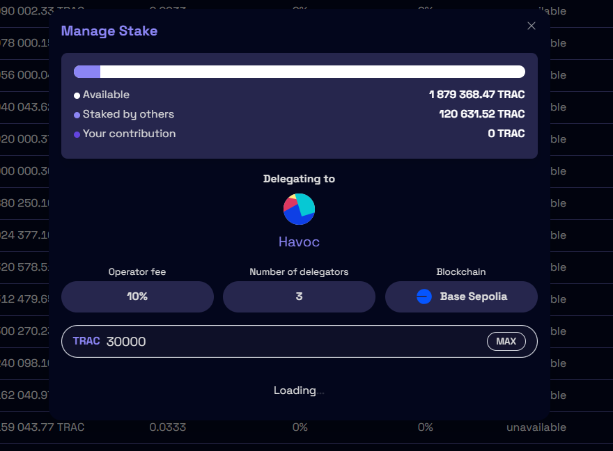

# V8 Incentivised Testnet - Measure, Manage, Master

<figure><figcaption></figcaption></figure>

As with former updates, the launch of the new version 8 of OriginTrail DKG is a joint effort of the OriginTrail community, driven by **an incentivised testnet** system. **The goal of the V8 incentivised testnet is to ensure security, scalability and usability for all ecosystem participants in a joint test environment, before releasing the new version to the DKG mainnet.**&#x20;

With the incentivised testnet, we will co-develop the V8 technological components, constantly measuring performance of individual services, testing the new features and scalability improvements, improving user and developer experience and ultimately reaching maturity for a production release on the mainnet. As always, development is done in an open source manner, however avoiding the usual "tragedy of the commons" of open source development by **incentivising all eligible contributors with a total incentive pool of 1 000 000 TRAC tokens.**

There following four categories of contributions and their incentive pools are indicated below.

| Incentivised Activity                              | Required technical level | Reward Budget |
| -------------------------------------------------- | ------------------------ | ------------- |
| Staking & UI testing                               | Low                      | 100 000 TRAC  |
| Running core nodes                                 | Medium                   | 100 000 TRAC  |
| Bug submissions & Code contributions               | Medium                   | 50 000 TRAC   |
| Building Paranets (inception program for Builders) | High                     | 750 000 TRAC  |


Incentivised testnet rewards are subject to the [V8 terms and conditions](https://dkg-v8-incentivised-testnet.origintrail.io/terms-and-conditions)


The V8 testnet incentivisation will go through a "3 layer" process, each layer introducing new functionality.

### 1. Core infrastructure Layer:  V8 core nodes (completed)

In the first layer the core network infrastructure is established running the new V8 core nodes, which form the backbone of the DKG network. As features such as batch minting Knowledge Assets, random sampling and others are gradually rolled out on the network, the core nodes will **generate useful telemetry data on the V8 testnet operation,** which will be sent to the core development team and for which the community will be incentivised.

Each node contribution will be assigned a **score**, which is based on the activity of each node. Simply put, the more "a core node is being used", the more telemetry data it will generate, and the higher the node score. The most "rewarding" operation is publishing Knowledge Assets, which triggers the most activity on the network.

If you would like to run a V8 testnet core node, head over to [this page](../v8-dkg-core-node/run-a-v8-core-node-on-testnet/).


The core node incentivisation program of the V8 testnet has completed, read more about it [here ](claiming-rewards.md)&#x20;


### 2. AI Layer: V8 edge nodes (active)

To build on the DKG V8 and test out it's AI features, we have recently introduced [DKG V8 Edge Nodes,](../v8-dkg-edge-node/) designed to run neuro-symbolic, privacy enabled AI on the DKG on various edge devices, with high customizability for builders.  Builders looking to build on the DKG can join the [DKG Edge Node inception program](../v8-dkg-edge-node/dkg-edge-node-inception-program.md), which provides a pool of **750k TRAC tokens** for teams launching their paranets with  DKG Edge nodes on both the DKG V6 or V8 Mainnet, with tokens exclusively used to publish Knowledge Assets to their paranets.

### 3. Security Layer: V8 staking (actived on Mainnet Launch)

As part of the DKG V8 launch, a Staking security bounty will be deployed to test out the Staking system in the real economic environment of the DKG mainnet. The new improved Staking system includes a new Staking Dashboard and updated smart contracts - more details on the updates can be found [here](../dkg-v8-update-guidebook/#v8-staking-updates).

A total of 100.000 TRAC tokens for staking security bounty will be rewarded.

To be eligible users need to:&#x20;

* Stake TRAC on mainnet to test the upgraded V8 Staking Dashboard between Dec 26th 5pm CET and January 9th 5pm CET&#x20;
* Register for claiming the reward **from January 9th 5pm CET to January 16th 5pm** on the designated [reward claiming interface](https://dkg-v8-incentivised-testnet.origintrail.io/claim-rewards). Registration includes submitting KYC data for the purposes of reward distribution and qualitative feedback on the usage of staking interface.  &#x20;

The total reward amount will be distributed pro rata among eligible participants, according to the size of the stake they contributed during that period.&#x20;

Rewards will be distributed no later than **January 21st 5pm CET**. The 14 day period begins with an announcement of V8 launch, which will also carry a message regarding the V8 security bounty period beginning and the end.&#x20;


Qualified total stake is determined following the one week period after the 14 day period since the V8 launch, as a sum of all received claims through an claiming interface. Claims should be registered no longer than one week after the completion of the 14 day period.&#x20;


