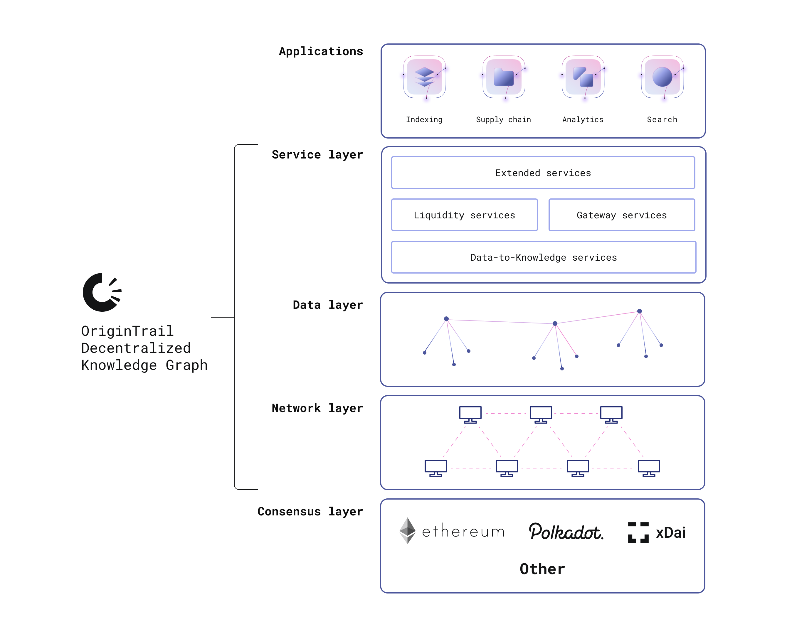

# OriginTrail - Decentralized Knowledge Graph \(DKG\)

## What is a decentralized knowledge graph?

A **decentralized knowledge graph \(DKG\)** is a global shared knowledge graph that is designed to benefit organizations and individuals by providing shared public infrastructure for knowledge exchange. 

The OriginTrail DKG:

* removes central authorities - is hosted on the OriginTrail Decentralized Network \(ODN\)
* utilizes DIDs & Verifiable Credentials for identity and assertions management
* enables Dapps with search, integration, analytics, AI and ML capabilities for any data source: blockchains, IPFS, enterprise systems, web services, personal devices
* enables permissionless PUBLISH and QUERY operations

The OriginTrail Decentralized Network is an implementation of the OriginTrail DKG. With the ODN therefore you can **query for data across a multitude of systems** \(discovery\), to **exchange it** via several data exchange protocols and **integrate it** in your own local knowledge graph or data store. 


_If you are looking to jump right into the code, head over to the_ [_Getting Started_](../developers/getting-started.md) _page._


## System architecture

We distinguish several layers of the DKG:

* **the network layer**, formed by a peer to peer swarm of DKG nodes hosted by individuals and organisations, implementing S/Kademlia
* **data layer**, hosting the knowledge graph data, distributed across the network in separate instances of graph databases
* **service layer**, implementing various core & extended services, such as authentication, standard interfaces and data pipelines
* **the consensus layer**, implementing interfaces to several blockchains hosting trusted smart contracts, used to manage relations between the nodes and implement trustless protocols \(currently supporting Ethereum, xDai blockchain and the OriginTrail Polkadot Parachain\)
* **application layer,** encompassing both Dapps and traditional applications which utilize the OriginTrail DKG as part of their data flows.

We also distinguish between:

* the **public, replicated knowledge graph**, shared by all network nodes according to the protocol
* **private graphs**, hosted separately by each of the networked nodes, connected with the public knowledge graph

The public knowledge graph is used to enable data discoverability by hosting a decentralized index of information, replicated across the network, enabling search queries through its discovery protocols. Once information is discovered in separate \(private\) graphs, data exchange protocols are used to obtain full query results. An example of a data exchange protocol is a data marketplace protocol, implementing trusted data-for-tokens exchange.

The protocol actors are:

* data creator nodes \(DC\), responsible for publishing datasets to the DKG
* data holder nodes \(DH\), hosting the DKG datasets, incentivised by tokens deposited by DCs
* data viewers \(DV\), usually services or dapps that query the DKG
* data providers \(DP\), which provide data to DC nodes for publishing

The distinction between DC and DH nodes is only behavioural, as they implement the same interfaces \(each node can be both a DH and a DC node at the same time\).

\*\* Currently data providers need to run their own DC nodes to publish data to the network, which is about to change in version 6 with the introduction of gateway services.

Therefore, a dataset published to the DKG by a DC node:

* contains a cryptographic identity \(DID\) of the DC and DP, rooted in one of the supported blockchain networks
* is structured as graph linked data
* has a corresponding set of cryptographic fingerprints \(graph merkle roots\) stored immutably on a blockchain
* is timestamped and has a "data lifespan" on the network 
* is randomly replicated across peers based on a DKG content addressing scheme

In this way, any given graph vertex or edge \(triple\) in the DKG can be verifiably associated with a publisher DID, its originating dataset and cryptographic hashes proving it being contained in that dataset, as well as enabling data integrity verification on-chain & off chain. 

