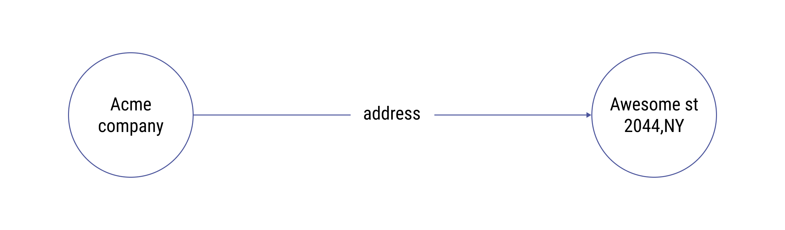
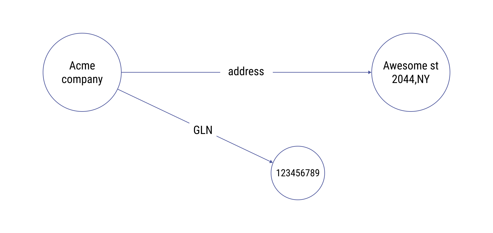
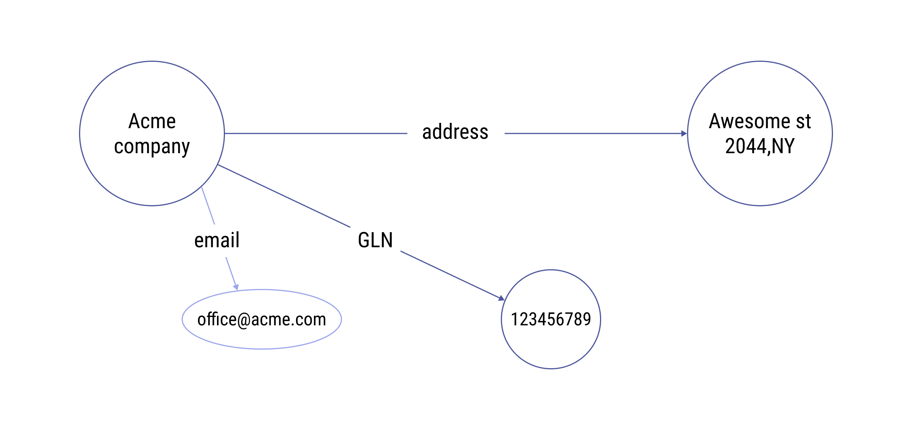

# Linked data & knowledge graphs

### The challenges of scattered data

Developers constantly struggle with **discovering, sharing** and **managing data** coming from different systems in different formats. This requires understanding, structuring, integrating and verifying the data each time new features or applications are built based on that data.

In Web2, **discoverability** is enabled by search engines, which return a list of web links based on the query you search for. **Sharing** and **managing** data is governed by centralised services and protocols which do not share common data structures and interfaces, making it complicated to access and use this data.

As a simple example, let's consider a traditional relational (SQL) database dataset like the one below

| id  | user         | address             | GLN       |
| --- | ------------ | ------------------- | --------- |
| 987 | ACME company | Awesome st 2044, NY | 123456789 |

Another system might keep some more data on this in another format, such as a CSV

```
company_name;company_address;email
ACME company; Awesome st 2044, NY; office@acme.com
```

As humans, we can quickly understand that this data is related to the same **thing** (ACME company), however it's not so obvious to software, as it generally doesn't have enough context. To use the example data above in apps one needs to resolve the challenges of having different data structures, schemas, means of access -  requiring many operations to understand, integrate and validate the datasets. For example, how would you query for the email address of ACME company? This is where the Semantic web helps.&#x20;

### What is linked data and the Semantic Web? 

> _"The Semantic Web isn't just about putting data on the web. It is about making links, so that a person or machine can explore the web of data. With linked data, when you have some of it, you can find other, related, data." - Tim Berners-Lee, the father of the World Wide Web and Semantic Web_

The core idea behind linked data is to actually represent all **things** with **relationships** between them in a common graph. Linked data is built on primitives called "**triples",** which connect a **subject entity**, with an **object entity** via a **relationship**.




Triples are great because they can be used to create more complex data structures - graphs. Roughly speaking, connecting two triples gives us this.



Integrating the two above mentioned example datasets according to the principles of Semantic web will therefore render a graph structure like this.




Having such a "semantic network" of data, we inherently add context and enable easy extensions. The semantic graph can be easily queried in many ways and enables growing a body of _knowledge_ around things, rather than keeping "tables of strings".&#x20;

In the coming sections we will show you how to use the OriginTrail Decentralized Knowledge Graph for data discovery and querying, however let's first explain what a knowledge graph is.

### What is a knowledge graph?

There are many definitions of knowledge graphs (KGs), all slightly different. Without emphasising on precision, all of them point to a knowledge graph as a network of entities — physical & digital objects, events or concepts — illustrating the relationship between them (aka a semantic network). KGs are used by major companies such as [Amazon](http://lunadong.com/talks/PG.pdf), [Google](https://en.wikipedia.org/wiki/Google\_Knowledge\_Graph), [Uber](https://www.youtube.com/watch?v=r3yMSl5NB\_Q), [IBM](https://www.ibm.com/cloud/learn/knowledge-graph) etc. for various applications: search, data integration, knowledge reasoning, recommendation engines, analytics, machine learning and AI etc.&#x20;

Key characteristics of knowledge graphs are:

* focus on data connections as "first class citizens" (linked data)
* designed to ingest data from multiple sources, usually in different formats
* flexible data models, easily extendable

For the moment we restrict this document only to a high level introduction and encourage the reader to research resources on the semantic web and knowledge graphs available online.


**Commonly knowledge graphs are deployed within the domain of one organisation and are designed to capture knowledge from various sources both from within and outside of the organisation.** These centralised knowledge graphs generate huge value for their owners, yet a decentralised globally shared knowledge graph brings orders of magnitude higher value to everyone participating. We present the **OriginTrail Decentralized Knowledge Graph** as the first permissionless, global open decentralized knowledge graph - read on.

