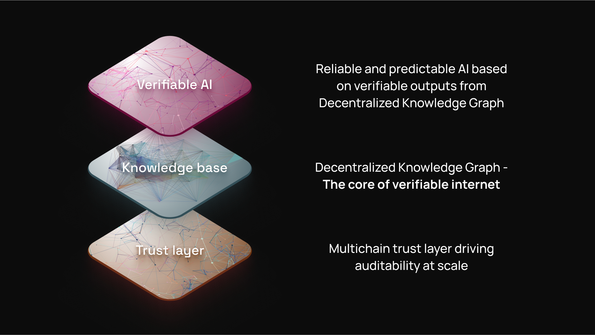

# Decentralized Knowledge Graph (DKG)

The OriginTrail Decentralized Knowledge Graph (DKG) is a **global decentralized data structure that interlinks Knowledge Assets in a semantic format (RDF)**, hosted on a permissionless peer-to-peer network. It enables a **verifiable knowledge layer** for artificial intelligence (AI) and other advanced applications.

### Why a Decentralized Knowledge Graph

Modern AI applications increasingly demand:

* **Structured, contextualized memory**
* **Data integrity and provenance**
* **Cross-system interoperability**

The DKG meets these needs by uniting the **trust layer of blockchains**, the **semantic expressiveness of knowledge graphs (symbolic AI),** and **state-of-the-art generative AI models (neural AI).**

### Why Use Blockchain?

Blockchains enable:

* **Trustless verification:** Every claim is anchored to a consensus-verified state
* **Decentralized Computation**: Blockchains enable consensus based code execution (e.g. via smart contracts) on decentralized networks, with no single point of control, perfect for building decentralized protocols like OriginTrail.
* **Data integrity and auditability:** Through cryptographic hashing and timestamping of data records on a blockchain, making it possible to verifiably track the origin of records and their update trail
* **Tokenization -** enabling decentralized participation and support of the system through the TRAC token, as well as the ability to tokenize data through Knowledge Assets

In the DKG, blockchain smart contracts handle:

* Identity (via DIDs)
* Knowledge Asset ownership (via NFTs) and temporal state anchoring (via graph fingerprints)
* decentralized service agreements between nodes and DKG users (through publishing and staking)

### Why Use Knowledge Graphs?

Knowledge graphs are the best approach to managing knowledge due to their rich context, flexibility and data integration capabilities. Specifically, knowledge graphs:

* Represent **relationships and context** between data
* Enable **semantic search and inferencing**
* Are **machine-readable and human-intelligible**
* Provide a foundation for interoperable data exchange

The DKG leverages the RDF data model and SPARQL query language, aligning with W3C Semantic Web standards.

### Why OriginTrail DKG combines Blockchains and Knowledge Graphs?

While powerful on their own, blockchains and knowledge graphs are **exponentially more effective** when combined:

* **Trust meets meaning** — Blockchains provide decentralized trust and data integrity, while knowledge graphs provide structured, meaningful context.
* **Immutable semantics** — Verifiable knowledge assets can be timestamped, hashed, and anchored on-chain, ensuring that their meaning is preserved over time.
* **Decentralized collaboration** — Communities or ecosystems can build shared knowledge bases without central authorities, enabled by smart contracts and semantic interoperability.
* **Discoverable and verifiable** — A knowledge graph indexed across a peer-to-peer network enables discovery of information, while blockchain ensures that what is found is provably authentic and untampered.

This synergy creates a foundational infrastructure for the next generation of intelligent and verifiable applications, from AI agents to decentralized identity, supply chain, healthcare, and beyond.

The DKG leverages the RDF data model and SPARQL query language, aligning with W3C Semantic Web standards.

### How Does the DKG Support Neuro-Symbolic AI

Neuro-symbolic AI combines the pattern recognition capabilities of neural networks with the reasoning capabilities of symbolic systems like knowledge graphs. The DKG enhances this hybrid approach in several critical ways:

* **Contextual grounding** — Structured RDF data allows LLMs and other neural systems to operate with clearly defined entities and relationships, enriching prompt responses and grounding model outputs in verifiable facts.
* **Retrieval-augmented generation (RAG)** — SPARQL-compatible queries over the DKG can fetch symbolic facts at runtime, improving relevance and reducing hallucination in generated content.
* **Symbolic reasoning** — The DKG’s RDF-based structure supports formal reasoning, inference rules, and logic-based querying, which neural networks can’t natively perform.
* **Neural graph reasoning** — Neural-symbolic architectures that operate over graph structures benefit from the DKG’s richly connected semantic data, enabling advanced reasoning tasks like entity disambiguation, link prediction, and knowledge completion.
* **Memory and feedback loops** — Persistent, verifiable memory allows autonomous agents to build and refer to structured experiences over time. When shared across multiple agents through a common knowledge graph, this forms a **collective memory** — enabling agents to learn from each other, reason jointly, and contribute to a growing corpus of semantically interlinked knowledge.

In short, the DKG is an essential infrastructure layer for building trusted, intelligent systems that integrate learning with logic.

## System architecture

OriginTrail synergizes blockchains, knowledge graphs (symbolic AI) and LLMs (neural AI) in a 3-layer architecture, where each layer is implemented as a decentralized network.&#x20;

**The trust layer leverages blockchains as trust networks,** established to enable reliable computation through **decentralized consensus**, operating as a global, dependable computer. It is used to track the origin of knowledge, its provenance, integrity and enable decentralized economic interactions in the system.

**The knowledge base layer is the core of the DKG,** implemented as a peer to peer network of DKG Core nodes, **leveraging knowledge graphs serve as semantic data networks** for **knowledge management, tightly integrating with** the trust layer.

**The verifiable AI layer** hosts AI agents and systems leveraging both the knowledge base and the trust layer underneath. This is the realm of the DKG Edge Nodes, as well as MCP and other integration enablers, with operations supported by the Knowledge Base and Trust layers below.

<figure><figcaption>
The three layers of OriginTrail
</figcaption></figure>
